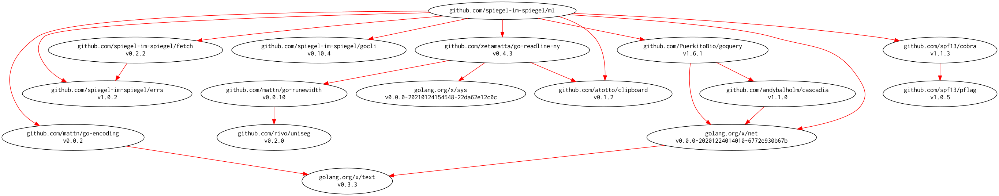

# [ml] -- Make Link with Markdown Format

[](https://github.com/goark/ml/actions)
[](https://github.com/goark/ml/actions)
[](https://github.com/goark/ml/actions)
[](https://raw.githubusercontent.com/goark/ml/master/LICENSE)
[](https://github.com/goark/ml/releases/latest)

This package is required Go 1.16 or later.

**Migrated repository to [github.com/goark/ml][ml]**

## Build and Install

```
$ go install github.com/goark/ml@latest
```

## Binaries

See [latest release](https://github.com/goark/ml/releases/latest).

## Usage

```
$ ml -h
Usage:
  ml [flags] [URL [URL]...]

Flags:
      --debug               for debug
  -h, --help                help for ml
  -i, --interactive         interactive mode
  -l, --log int             history log size
  -s, --style string        link style [markdown|wiki|html|csv|json] (default "markdown")
  -a, --user-agent string   User-Agent string
  -v, --version             output version of ml
```

```
$ ml https://git.io/vFR5M
[GitHub - goark/ml: Make Link with Markdown Format](https://github.com/goark/ml)
```

```
$ echo https://git.io/vFR5M | ml
[GitHub - goark/ml: Make Link with Markdown Format](https://github.com/goark/ml)
```

### Support Other Styles

```
$ ml -s html https://git.io/vFR5M
<a href="https://github.com/goark/ml">GitHub - goark/ml: Make Link with Markdown Format</a>
```

Support Styles: `markdown`, `wiki`, `html`, `csv`, `json`

### Interactive Mode

```
$ ml -i
Input 'q' or 'quit' to stop
ml> https://git.io/vFR5M
[GitHub - goark/ml: Make Link with Markdown Format](https://github.com/goark/ml)
ml>
```

## With Go Codes

```go
package main

import (
    "context"
    "fmt"
    "io"
    "os"

    "github.com/goark/ml/makelink"
)

func main() {
    lnk, err := makelink.New(context.Background(), "https://git.io/vFR5M", "")
    if err != nil {
        fmt.Fprintln(os.Stderr, err)
        return
    }
    _, _ = io.Copy(os.Stdout, lnk.Encode(makelink.StyleMarkdown))
    // Output:
    // [GitHub - goark/ml: Make Link with Markdown Format](https://github.com/goark/ml)
}
```

## Modules Requirement Graph

[](./dependency.png)

[ml]: https://github.com/goark/ml "goark/ml: Make Link with Markdown Format"
