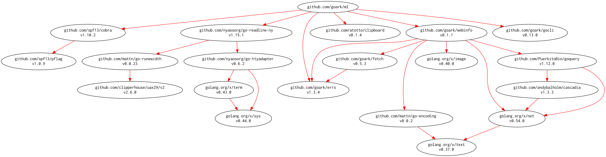

# [ml] -- Make links from web page metadata

[](https://github.com/goark/ml/actions)
[](https://github.com/goark/ml/actions)
[](https://github.com/goark/ml/actions)
[](https://raw.githubusercontent.com/goark/ml/master/LICENSE)
[](https://github.com/goark/ml/releases/latest)
[](https://pkg.go.dev/github.com/goark/ml)

`ml` is a CLI and Go package to fetch web page metadata and render it as links
in multiple output styles (`markdown`, `wiki`, `html`, `csv`, `json`).

## Design goals

- Keep CLI behavior simple for command-line and stdin workflows.
- Keep output style conversion deterministic and explicit.
- Reuse `github.com/goark/webinfo` for metadata extraction logic.
- Preserve compatibility of exported symbols when possible.

## Development

### Requirements

- Go 1.26.3 or later
- [Task](https://taskfile.dev/) command (local tool for this repository)

### Local validation

```text
task test
task govulncheck
```

Run all maintenance tasks:

```text
task
```

## CI Workflows

- `ci`: lint (`golangci-lint` with `gosec`), tests, and `govulncheck`
- `CodeQL`: scheduled and push/PR static analysis
- `build`: release build on `v*` tags via GoReleaser

## Usage

### Install

```bash
go install github.com/goark/ml@latest
```

### CLI examples

```bash
ml https://git.io/vFR5M
```

```bash
echo https://git.io/vFR5M | ml
```

Use another style:

```bash
ml -s html https://git.io/vFR5M
```

Interactive mode:

```text
ml -i
Input 'q' or 'quit' to stop
ml> https://git.io/vFR5M
[GitHub - goark/ml: Make Link with Markdown Format](https://github.com/goark/ml)
ml>
```

### Public API

- `makelink.New(ctx, urlStr, userAgent)` fetches metadata and builds a `Link`.
- `(*makelink.Link).Encode(style)` renders output in the given style.
- `makelink.GetStyle(name)` resolves style strings.

### Use as a Go package

```go
package main

import (
	"context"
	"fmt"
	"io"
	"os"

	"github.com/goark/ml/makelink"
)

func main() {
	lnk, err := makelink.New(context.Background(), "https://git.io/vFR5M", "")
	if err != nil {
		fmt.Fprintln(os.Stderr, err)
		return
	}
	_, _ = io.Copy(os.Stdout, lnk.Encode(makelink.StyleMarkdown))
}
```

## Behavior notes

- Metadata extraction is delegated to `github.com/goark/webinfo`.
- `CanonicalURL()` falls back in this order: canonical -> location -> input URL.
- `TitleName()` falls back to URL when title is empty.

## Error handling

This project wraps internal errors with `github.com/goark/errs`.

## Modules Requirement Graph

[](./dependency.png)

[ml]: https://github.com/goark/ml "goark/ml"
