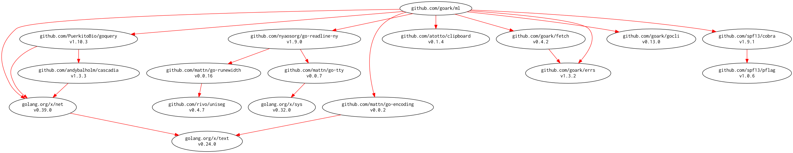

# [mklink] -- Make Link with Markdown Format

[](https://travis-ci.org/spiegel-im-spiegel/mklink)
[](https://raw.githubusercontent.com/spiegel-im-spiegel/mklink/master/LICENSE)

## Install

```
$ go get github.com/spiegel-im-spiegel/mklink
```

Installing by [dep].

```
$ dep ensure -add github.com/spiegel-im-spiegel/mklink
```

## Usage

```go
link, err := mklink.New("https://git.io/vFR5M")
if err != nil {
    fmt.Println(err)
    return
}
fmt.Println(link.Encode(mklink.StyleMarkdown))
// Output:
// [GitHub - spiegel-im-spiegel/mklink: Make Link with Markdown Format](https://github.com/spiegel-im-spiegel/mklink)
```

## Command Line Interface

```
$ mklink -h
Usage:
  mklink [flags] [URL [URL]...]

Flags:
  -h, --help           help for mklink
  -i, --interactive    interactive mode
      --log string     output log
  -s, --style string   link style (default "markdown")
  -v, --version        output version of mklink
```

```
$ mklink https://git.io/vFR5M
[GitHub - spiegel-im-spiegel/mklink: Make Link with Markdown Format](https://github.com/spiegel-im-spiegel/mklink)
```

```
$ echo https://git.io/vFR5M | mklink
[GitHub - spiegel-im-spiegel/mklink: Make Link with Markdown Format](https://github.com/spiegel-im-spiegel/mklink)
```

```
$ mklink --log log.txt https://git.io/vFR5M
[GitHub - spiegel-im-spiegel/mklink: Make Link with Markdown Format](https://github.com/spiegel-im-spiegel/mklink)

$ cat log.txt
[GitHub - spiegel-im-spiegel/mklink: Make Link with Markdown Format](https://github.com/spiegel-im-spiegel/mklink)
```

### Interactive Mode

```
$ mklink -i
Press Ctrl+C to stop
mklimk> https://git.io/vFR5M
[GitHub - spiegel-im-spiegel/mklink: Make Link with Markdown Format](https://github.com/spiegel-im-spiegel/mklink)
mklimk>
```

### Support Other Style

```
$ mklink -s html https://git.io/vFR5M
<a href="https://github.com/spiegel-im-spiegel/mklink">GitHub - spiegel-im-spiegel/mklink: Make Link with Markdown Format</a>
```

Support: `markdown`, `wiki`, `html`, `csv`

## Dependencies

```
dep status -dot | dot -Tpng -o dependency.png
```

[](dependency.png)

[mklink]: https://github.com/spiegel-im-spiegel/mklink "spiegel-im-spiegel/mklink: Make Link with Markdown Format"
[dep]: https://github.com/golang/dep "golang/dep: Go dependency management tool"
